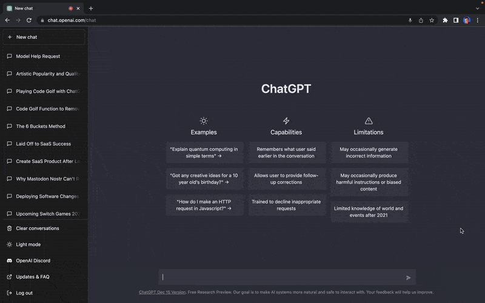

# Chat GPT-3 Voice Extension

A simple extension to enable voice interactions in OpenAI's ChatGPT:

https://chat.openai.com/

<!--  -->

## Instructions

### Chrome:
4. Open [chrome://extensions/](chrome://extensions/)
5. Enable Developer Mode (toggle in upper right corner of screen)
6. Click "Load Unpacked" (top-left corner)
7. Select your extension directory

### Firefox: 
4. Navigate to (about:debugging#/runtime/this-firefox)[about:debugging#/runtime/this-firefox] in your browser.
5. Click Load Temporary Addon & then select the manifest.json in the folder you just created

### That's it!

Remember, Updates don't occur automatically when you manually install the extension from source. `¯\_(ツ)_/¯`

## Using the extension
1. Navigate to [https://chat.openai.com/](ChatGPT), allow microphone, and talk to ChatGPT!
2. You will see your text input in the prompt box.
3. You get 5 seconds to cancel before it's automatically submitted.